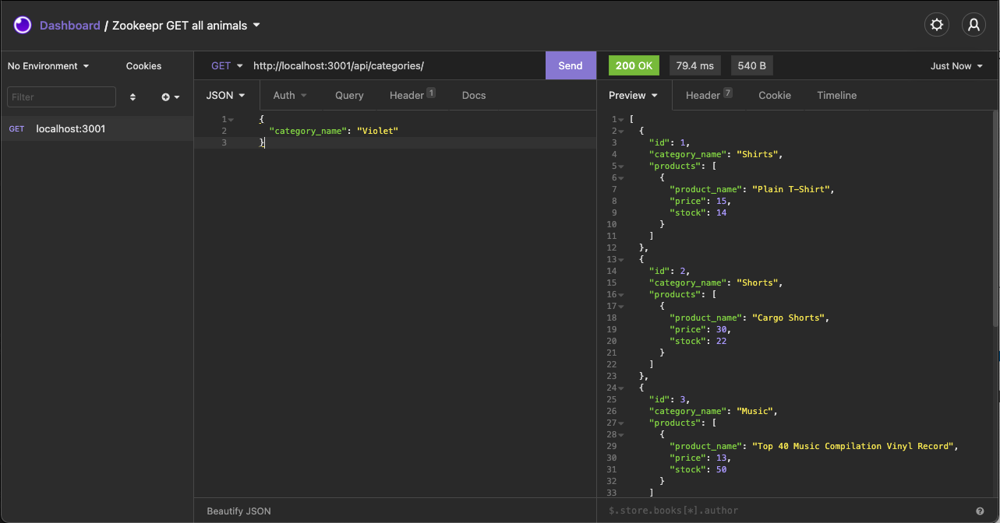
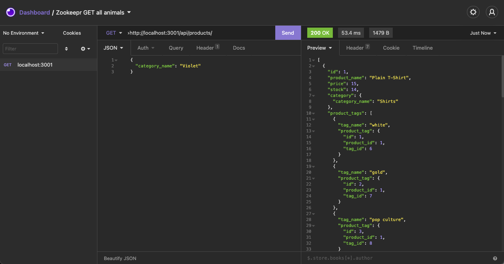
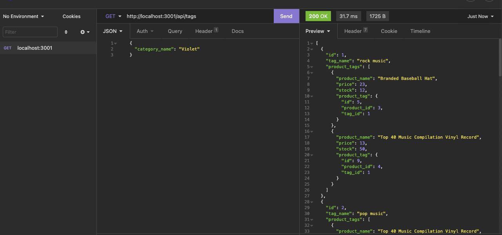

# Ecommerce-Tech Database
  

  ## Description
  The challenge for this week involves building the back end for an e-commerce site. This involves building Sequelize models for the different tables and setting up the Express routes that will either read or modify the database depending on the REST API calls. 

  ## Table of Contents

* [Installation](#installation)
* [Usage](#usage)
* [Credits](#credits)
* [License](#license)
* [Video](#video)
* [Questions](#questions)

## Installation
1: Clone the repository from Github 2:  Run NPM Install to install the modules 3:  Run "npm run seed" to seed the database 4:  Run "npm start" or "nodemon server.js" to start the server 5:  Use Insomnia or another REST client to make REST API calls on the server 

## Usage

## License
https://opensource.org/licenses/MPL-2.0  
Licensed under Mozilla Public License 2.0

## Video
https://drive.google.com/file/d/1dcKENKgIMV5NN5e_cr4xRt4eh-kjmvd2/view

## Questions
https://github.com/askarrizvi  